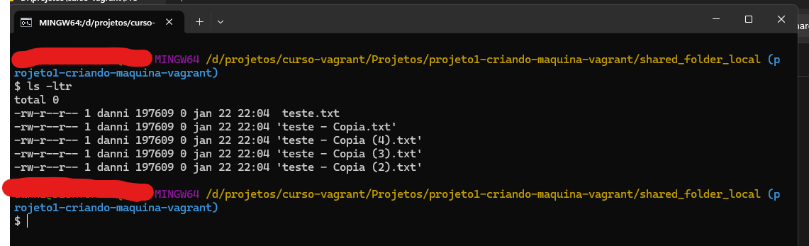
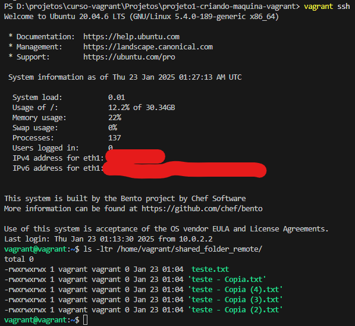

# projeto1-criando-maquina-vagrant

Este projeto configura uma máquina virtual utilizando o Vagrant e o VirtualBox, criando uma VM com o sistema operacional Ubuntu.

## Tecnologias Utilizadas
- **Linguagem/Framework**: Ruby (usado pelo Vagrant para configuração)
- **VirtualBox** (ou VMWare): Software de virtualização para executar a máquina virtual.

## Como Usar
1. Clone o repositório:
   ```bash
   git clone https://github.com/dannielvroque/projeto1-criando-maquina-vagrant

2. Construindo a VM

   Criar o diretorio "shared_folder_local" na raiz do projeto
   
   ```bash
   mkdir shared_folder_local

3. Executando a VM
   
   Dentro do Projeto, executar o comando abaixo, Este comando ira efetuar o download da imagem ubuntu, e criar a VM 
   
   ```bash
   vagrant up

4. Testando a VM

   Ao finalizar a configuracao da VM apos o vagrant up, ela estara disponivel para uso atraves do comando abaixo:

   Este comando efetuara a conexao SSH com a VM criada

   ```bash
   vagrant ssh

5. Usando a pasta compartilhada

   Dentro do diretorio local onde o projeto foi baixado, foi criada a pasta shared_folder_local, dentro dela, pode-se criar algum arquivo de teste, como por exemplo "teste.txt"
   
   

   Depois de criado este arquivo, podemos verificar dentro da VM(conforme passo 4 para testes e conexao) que o arquivo esta compartilhando dentro da pasta "shared_folder_remote"

   ```bash

   ls -ltr /home/vagrant/shared_folder_remote
  
   

   
